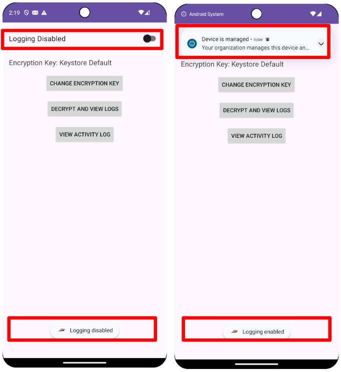
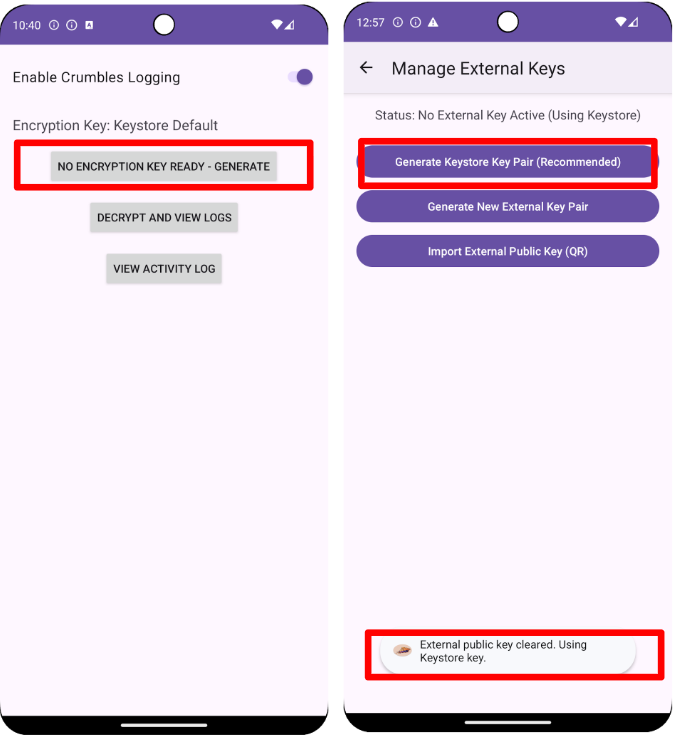
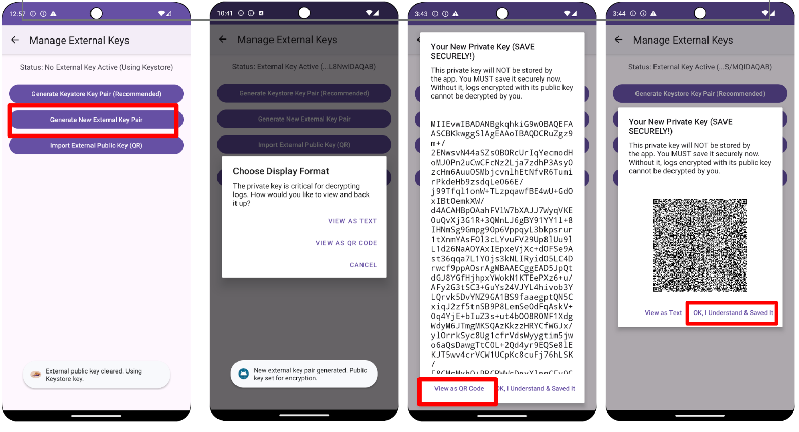

# Crumbles How-To

## What is Crumbles?
Crumbles is an app that collects security and network logs in Android devices
which would otherwise be available only to employers in Enterprise settings.
Crumbles encrypts these logs with flexible encryption key management and uploads
them to any remote storage location of choice. Crumbles facilitates sharing
these logs while encrypted with any trusted 3rd party.

## Why should I install it?
Security and network logs, if shared with forensic analysts, allow exploits
detection. This is relevant especially for users who are more targeted by
state-sponsored attacks than others (At-Risk-Users).

## Okay, how do I install it?

On your Android phone:

1. [Back up your data](https://support.google.com/android/answer/2819582?hl=en).
2. [Factory reset your phone](https://support.google.com/android/answer/6088915?hl=en) without adding any Google Account. Warning: This process will completely erase your device. That's why it's important to backup your data first, in step (1).
3. [Enable USB Debugging](https://developer.android.com/studio/debug/dev-options).

The next steps depend on the Operating System that you use on your computer and
your skills.

### Using a terminal

1. Install adb if you do not have it yet, as follows. Download the [SDK Platform-Tools for your computer's OS](https://developer.android.com/tools/releases/platform-tools). Double-click on the downloaded file and follow the prompts.
2. Download [Crumbles_app.apk](https://github.com/google/crumbles/releases/v1.0/CrumblesApp.apk) version 1.0 or any other version of choice.
3. Plug your Android device into your computer (desktop/laptop/tablet) using a
USB cable. On your phone, check the **Always allow** box and tap **Allow** on the pop-up
dialog that appears when you plug in your phone.
4. Open a terminal and run the following commands:
    ```
    $ cd <path of the folder where you saved your downloaded apk>
    $ adb install -r Crumbles_app.apk
    $ adb shell dpm set-device-owner com.android.securelogging/.CrumblesDeviceAdminReceiver
    ```

### Using Windows

On your computer:

1. Download [setup_device.bat](https://github.com/google/crumbles/tree/main/setup_device.bat).
2. Download the [SDK Platform-Tools for Windows](https://developer.android.com/tools/releases/platform-tools). Double-click on the downloaded file and follow the prompts.
3. Plug your Android device into your computer (desktop/laptop/tablet) using a
USB cable. On your phone, check the **Always allow** box and tap **Allow** on the pop-up
dialog that appears when you plug in your phone.
4. On your computer, find the setup_device.bat file, double-click it and follow the prompts. When it's finished, it will say "SETUP COMPLETE!". If you see a "Success" message, it worked!

### Using Mac

On your computer:

1. Download [setup_device.command](https://github.com/google/crumbles/tree/main/setup_device.command).
2. Download the [SDK Platform-Tools for Mac](https://developer.android.com/tools/releases/platform-tools). Double-click on the downloaded file to unzip the platform-tools folder.
3. Move the setup_device.command file into the unzipped platform-tools folder.
4. Open the platform-tools folder.
5. Plug your Android device into your computer (desktop/laptop/tablet) using a
USB cable. On your phone, check the **Always allow** box and tap **Allow** on the pop-up
dialog that appears when you plug in your phone.
6. The very first time you run this, right-click on the setup_device.command file and choose Open.
7. You'll see a security warning because you downloaded the file. Click the
Open button to confirm you want to run it. The Terminal app opens
automatically and runs the script. Follow the on-screen instructions.
From now on, you can double-click the setup_device.command file to run it
again.

### Using Linux

On your computer:

1. Download [setup_device.sh](https://github.com/google/crumbles/tree/main/setup_device.sh) and [setup_device.desktop](https://github.com/google/crumbles/tree/main/setup_device.desktop).
2. Download the [SDK Platform-Tools for Linux](https://developer.android.com/tools/releases/platform-tools). Double-click on the downloaded file to unzip the platform-tools folder.
3. Open the platform-tools folder.
4. Place both the setup_device.sh and setup_device.desktop files inside it.
5. Plug your Android device into your computer (desktop/laptop/tablet) using a
USB cable. On your phone, check the **Always allow** box and tap **Allow** on the pop-up
dialog that appears when you plug in your phone.
6. Right-click on the setup_device.desktop file. Go to Properties -> Permissions. Check the box that says "Allow executing file as program" or "Is executable". Close the properties window.
7. Double-click the setup_device.desktop file.
8. Your system will likely ask if you trust this launcher. Click "Trust and Launch" or "Run". A terminal window will appear and run the script. Follow the instructions on the screen.

## I'm now ready to use Crumbles. What do I do?

It’s time to use Crumbles.

You can now unplug your phone from your computer and finish setting up your
phone. This means, for example, adding your Google Account and [restoring your
backed-up data](https://support.google.com/android/answer/2819582?hl=en).
The Crumbles app should already be installed on your phone
and ready to use.

1. Double-click on the Crumbles app.

   

2. Enable the logging toggle.

   

3. Choose which encryption key management to adopt.

    a. Whether to have Crumbles generate and keep the encryption keys.

    

    **Decryption**. In this case, you can also select
    encrypted logs files that you would like to decrypt.

    This option also gives you the chance to easily re-encrypt them to share
    them with a trusted 3rd party.

    

    b. Or whether you prefer to keep the private encryption key safely stored by
       yourself elsewhere.
    1. In this case you can either ask Crumbles to generate the private key that
    you will then take care of safely keeping elsewhere.

    

    2. Or if you already have an encryption key pair stored elsewhere whose
    public key you would like to use to encrypt your logs, you can ask Crumbles
    to import it.

    

      **Decryption**. Whenever you wish to decrypt your logs, you can download
      them from your remote storage location of choice and use your private key
      to decrypt them.

Once a day you will receive a notification about encrypted logs ready to be
uploaded to a remote storage location. Tap on the notification and select the
remote storage location that you prefer among all those installed on your phone.


## How to build

If you already have the Crumbles app running on your device and you would like
to substitute it with a version that you built yourself, then you don't need
to factory reset your device before follow these steps below.

Otherwise, do
factory reset and then follow the steps below **before registering any google
account on your device**.

1. [Clone this repository](https://docs.github.com/en/repositories/creating-and-managing-repositories/cloning-a-repository)
2. Add your build tool of choice (for example [gradle)](https://gradle.org/).
3. Add the following dependencies in your build file (for example `build.gradle`).

    * Guava jdk5
    * Androidx: appcompat, biometric, camera, recyclerview, constraintlayout, fragment, work
    * Zxing qr-code-writer
    * Robolectric
    * Mockito
    * JUnit
    * Google Protobuf
    * Google Truth

4. Add the attribute `debuggable=true` to the [AndroidManifest.xml](src/main/AndroidManifest.xml). This is necessary to run the instrumentation tests that are part of the building process.
5. If you wish to be able to build and substitute the version of Crumbles that you run on your device, without having to factory reset before every substitution, then add the attribute `testOnly=true` to the [AndroidManifest.xml](src/main/AndroidManifest.xml).

6. Run the following.

    ```
    $ cd <path of the folder where you cloned this repo>/crumbles
    $ <your build tool, for example `./gradlew`> build crumbles:all
    ```

7. Plug your Android device into your computer (desktop/laptop/tablet) using a
USB cable. On your phone, a pop-up titled "Allow USB debugging?" will appear.
Check the "Always allow" box and tap "Allow".

8. (Re)install the generated .apk

```
$ adb install -r <full path to the generated .apk>
```

9. If you had to factory reset at the start then also run the following, otherwise you can skip it. Crumbles needs to be set as device-owner only once.

```
$ adb shell dpm set-device-owner com.android.securelogging/.CrumblesDeviceAdminReceiver
```

## How to uninstall

Unfortunately, given its state as a device-owner app, the only way to remove
Crumbles is to factory reset your device again.

This isn't an oversight but a core security feature to ensure that an
enterprise-managed device cannot have its central control mechanism easily
removed.

## How to change the uploading frequency

Change the value of the constant named `SEND_REPEAT_INTERVAL_HOURS` in [CrumblesConstants.java](src/main/java/com/android/securelogging/CrumblesConstants.java) with the amount of hours after which you would like the encrypted logs upload to occur.

The default is 8 hours.

Then [build and install this project](#how-to-build).

## FAQ
### Why do I need to factory reset my phone?
For Crumbles to work correctly, it must be the first thing installed on your device after a factory reset. Why is that? Crumbles takes advantage of Android Enterprise functionality, which is an “MDM” or Mobile Device Management software. Crumbles does this so it can have the access necessary to collect the logs allowing forensic analysts to catch nefarious activity that may occur on your device.

The command necessary to set Crumbles as a device-owner app would not work
unless the device was in a specific, pristine system state known as
"unprovisioned" which can only be achieved via factory reset along with no user
accounts registered.
