# Crumbles

See how to install and use Crumbles in the [HOW_TO]()HOW_TO.md).

## tl;dr

Crumbles is an Android Device-Owner app that allows you to collect more logs to
help forensic analysis and suspicious activity detection, while still preserving
your privacy. Here we describe Crumbles features, If you want to know how to
install Crumbles and use it then please go to the [HOW_TO](HOW_TO.md)

## How Crumbles works

### Setup your phone

### Setup Crumbles

### Encrypted Logs Upload

```mermaid
graph TD
    A{{Crumbles shows a daily<br/>upload notification 🔔}} --> B[Click on the notification];
    B --> C{Choose a remote-storage app<br/> e.g., Google Drive, Dropbox};
    C --> D[Interact with the app to select<br/>the folder, recipient, etc.];
    D --> E((✅ Upload Complete: Continue usual activities));
```

### View your own logs

Please refer to the following structure in the following order, when parsing the
ciphertext in the .bin files. See also the
[protobuf definition](src/main/logs.proto).

1.  LogData: bytes. This is the actual logs encrypted
2.  LogKey: a. key encryption type = 1. This is the asymmetric algorithm used to
    encrypt the symmetric key. b. bytes. This is the encrypted (unique for each
    batch of logs) symmetric key. Key Length: 256 bits c. bytes. This is the IV
    (necessary for decryption). IV Length: 12 bytes.
3.  LogMetadata: a. unsigned int32: blob size. This is the length of the LogData
    bytes. b. timestamp: milliseconds c. device ID = 123456789 (it's just a
    placeholder) d. logs encryption type = 1. This is the AES+GCM symmetric
    encryption algorithm used to encrypt the logs.

### Re-encrypt and share

**When does this option apply?** You have chosen to store your encryption key in
Keystore so that only you can decrypt your own logs, but then decide that you
want a 3rd-party to look through them because you suspect your device has been
compromised. In this case, proceed as follows.

```mermaid
graph TD
    A[Start: Decrypt the logs you want to share<br/>using the app's 'Decrypt and View Logs' function];
    A --> B[On the decrypted logs screen,<br/>click the 'Re-encrypt and share' button];
    B --> C[Tap 'Import external public key'<br/>to open the QR code scanner];
    C --> D[Receive the public key QR code<br/>from the trusted 3rd-party];
    D --> E[Scan their QR code with the<br/>in-app scanner];
    E --> F[Select the new re-encryption key<br/>that now appears in the list];
    F --> G{Choose your preferred sharing app<br> e.g., Gmail, Google Drive};
    G --> H((Process Complete: Logs are re-encrypted<br/>and shared with the 3rd party 🤝));

```

## Technical and Security details

### Device-Owner app

A Device-Owner app is an app that usually an employer develops to manage its
employees' phones. In this case though, there is no employer. Rather each user
becomes the employer of themselves.

Crumbles needs to be a Device-Owner app because the additional logs it provides
now to all users, had so far been available only to enterprises (i.e.,
Device-Owner apps developed by employers).

### Additional logs

Crumbles collects additional logs such as - so far -
[Security](https://developer.android.com/reference/android/app/admin/SecurityLog)
and [Network](https://developer.android.com/work/dpc/logging) logs.

### Users' Privacy

Crumbles preserves users' privacy by encrypting all logs that it collects and
uploading the ciphertext remotely.

Each batch of logs is encrypted with a unique symmetric key using AES-GCM (which
ensures confidentiality and integrity). Each symmetric key is then encrypted
with an RSA public key (ensuring authenticity) and it becomes part of the
ciphertext along with the IV. This RSA public key can be either of the
following:

1.  part of a key pair stored in Android Keystore.
2.  part of a key pair generated by Crumbles but whose private key is stored
    outside of Crumbles, under the user's responsibility.
3.  part of a key pair generated elsewhere (e.g., NGOs or forensic labs), whose
    private key is stored outside of Crumbles, under the user's responsibility.
    In this case the public key can be imported via QR-code (the user needs to
    use a QR-code generator tool to generate the QR-code of the base64-encoded
    public key).

### Phone loss or theft

Case (1) above means that all past encrypted logs can not be decrypted anymore
and are lost for good. This is because it is impossible to export keys from
Keystore and therefore create a backup anywhere.

Case (2) or (3) above means that past logs can be decrypted without any issue
since the user can access both past encrypted logs as well as private key,
independently of the phone itself.

### Advanced (state-level) exploits

**New Logs.** At-Risk-Users are the Android users most targeted by advanced
exploits which are usually government-sponsored. In this type of attacks,
attackers gain system-level privileges and therefore they would be able to
access the logs sources directly so all new logs would leak.

**Past Encrypted Logs.** Past encrypted logs would not be accessible in most
cases, as per following explanation.

*   Case (1) above, protects past encrypted logs from attackers who gain
    system-level privileges if-and-only-if the Android Keystore is bounded to
    secure hardware such as a Trusted Execution Environment (TEE) or StrongBox.
*   Case (2) and (3) above, protects past encrypted logs from attackers who gain
    system-level privileges.

### Decryption

Only case (1) above allows to decrypt any amount of encrypted files within
Crumbles. This decryption requires user authentication (using any credentials
such as pin or passcode, etc. or biometrics that the user has set up as their
lockscreen).

In all other cases, the decryption needs to happen elsewhere, since Crumbles
does not have access to the private key.

### Sharing with 3rd-parties (e.g., NGOs or forensic labs)

In case (1) above, Crumbles provides an option to share encrypted logs safely
(i.e., without revealing the user's private key) with 3rd-parties.

After having decrypted the files that the user wants to share, the user can
select the option *Re-encrypt & share* then either generate a new key pair for
re-encryption or import a public key for re-encryption.

The re-encryption keys available are listed, the user chooses one and Crumbles
asks via which other app (Signal or GDrive, etc.) the user wants to share the
selected decrypted files, re-encrypted with the chosen public key.

This facilitates sharing with NGOs even in case(1).

In case (2) and (3) above, sharing with 3rd-parties is instead straightforward
since the private key could have been in the 3rd-parties hands all along (case
(3)) or the user could responsibly share it with 3rd-parties (case (2)) just as
much as they responsibly kept it in a safe location all along.
